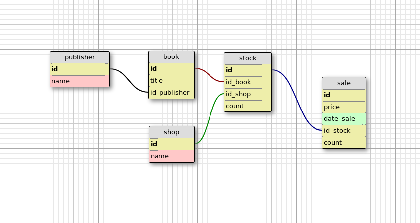

## Задание 1

Составить модели классов SQLAlchemy по схеме:

Необходимо выбрать подходящие типы и связи полей.

## Задание 2

Используя SQLAlchemy, составить запрос выборки магазинов, продающих целевого издателя.

Напишите Python скрипт, который:

- Подключается к БД любого типа на ваш выбор (например, к PostgreSQL).
- Импортирует необходимые модели данных.
- Выводит издателя (publisher), имя или идентификатор которого принимается через `input()`.

## Задание 3

Заполните БД тестовыми данными из файла `tests_data.json`.

